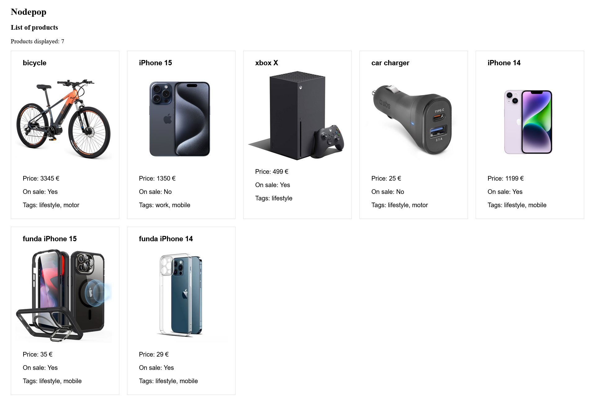

# API Nodepop - Módulo de Node.js, Express.js - KeepCoding.

Welcome to Nodepop API documentation. This API provides access to a collection of resources related to products.

## Install:

Install dependencies:

```ssh
$ npm install
```

Review database connection on /lib/connectMongoose.js (see "Star a MongoDB server only in MacOs or Linux")

## Start a MongoDB server only in MacOS or Linux:

From the folder of server:

```ssh
./bin/mongod --dbpath ./data
```

Load data:
This comand delete all the data in the database and create default data:

```ssh
$ npm run initDB
```

## Start

In production:

```ssh
$ npm start
```

In development:

```ssh
$ npm run dev
```

## API Endpoints:

### Products

- **List Products**

  - `GET /api/products`
  - Gets a list of all available products.

```json
{
  "result": [
    {
      "products": [
        {
          "_id": "651c2fbfb2884810f8b92df8",
          "name": "bicycle",
          "sale": true,
          "price": 3345,
          "photo": "./images/bicycle.jpg",
          "tags": ["lifestyle", "motor"]
        },
        {
          "_id": "651c2fbfb2884810f8b92df9",
          "name": "iPhone 15",
          "sale": false,
          "price": 1350,
          "photo": "./images/iphone15.jpg",
          "tags": ["work", "mobile"]
        }
        // more products...
      ]
    }
  ]
}
```

- **Get a Product by ID**

  - `GET /api/products/{id}`
  - Get detailed information about a specific product by its ID.

```json
{
  "result": [
    {
      "products": [
        {
          "_id": "651c2fbfb2884810f8b92df8",
          "name": "bicycle",
          "sale": true,
          "price": 3345,
          "photo": "./images/bicycle.jpg",
          "tags": ["lifestyle", "motor"]
        }
      ]
    }
  ]
}
```

- **Create a New Product**

  - `POST /api/products`
  - Create a new product with the information provided.

```json
{
  "name": "iPhone 15 Pro",
  "sale": "false",
  "price": 1599,
  "photo": "./images/iphone15pro.jpg",
  "tags": ["lifestyle", "mobile"]
}
```

- **Update a Product**

  - `PUT /api/products/{id}`
  - Update the information of an existing product by its ID.

```json
{
  "sale": "true",
  "price": 1350
}
```

- **Delete a Product**

  - `DELETE /api/products/{id}`
  - Delete an existing product by its ID.

- **Error**
  In case of errors, the API will provide a response with a corresponding HTTP status code and a descriptive error message.
  Example error response:

  ```json
  {
    "error": "Not Found"
  }
  ```

## WebSite EndPoints:

### Products

- **List Products**

- `GET /3000`


